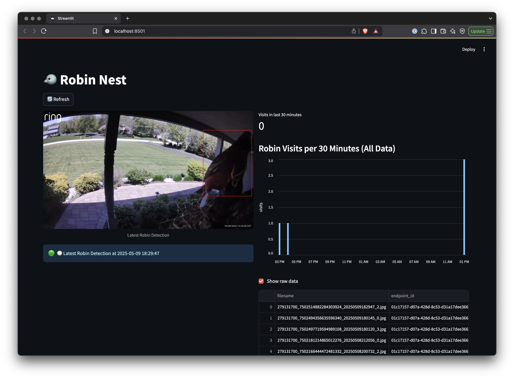

# Nest Cam

Tracking robin visits to a nest using Ring cameras, LandingAI, Snowflake, and Streamlit.



## Prerequisites

- [Ring Camera Subscription](https://ring.com/)
- [Snowflake](https://app.snowflake.com/)(non-trail account)
- [LandingLens Native Snowflake App](https://www.landing.ai/snowflake/)(by request from LandingAI)

## Installation

```
git clone git@github.com:strongio/nestcam.git

cd nestcam
pip install -e .
```

### Setup

<details>
<summary><b>LandingLens on Snowflake</b></summary>

Request access to LandingLens on Snowflake from [LandingAI](https://www.landing.ai/snowflake/). Once you have access, follow the instructions provided by LandingAI to set up the app.

#### Steps

**1. Create a Project**: A project in LandingLens will contain connect to your snowflake account to pull data for annotation, training. This is where you'll train your models and create your cloud deployment endpoints.

**2. Collect Data**: Once Snowflake is setup and your Ring camera is connected you'll want to collect data and annotate it.

**3. Train a Model**: Once you have enough data, you can train a model. This will take some time depending on the size of your dataset and the complexity of the model.

**4. Deploy**: A trained model can be deployed to a Snowflake-native endpoint. This will allow you to run inference on your data in Snowflake.

</details>

<details>
<summary><b>Snowflake</b></summary>

Create a database and schema for the app to use. This is where you'll upload your data for training and inference as well as store inference results.

```sql
CREATE DATABASE IF NOT EXISTS LANDINGLENS_DEMO_DB;
USE DATABASE LANDINGLENS_DEMO_DB;

CREATE SCHEMA IF NOT EXISTS VIDEO_STREAM;
USE SCHEMA VIDEO_STREAM;

CREATE STAGE IF NOT EXISTS VIDEO_STREAM_IMAGES;
```

You'll need to grant usage of these objects to the LandingLens app.

```sql
-- Grant permissions to application LANDINGLENS_DEMO
GRANT USAGE ON DATABASE LANDINGLENS_DEMO_DB TO APPLICATION LANDINGLENS_DEMO;
GRANT USAGE ON SCHEMA LANDINGLENS_DEMO_DB.VIDEO_STREAM TO APPLICATION LANDINGLENS_DEMO;
GRANT READ ON STAGE LANDINGLENS_DEMO_DB.VIDEO_STREAM.VIDEO_STREAM_IMAGES TO APPLICATION LANDINGLENS_DEMO;
```

Create an inference table to store results.

```sql
CREATE TABLE VIDEO_STREAM_INFERENCE (
    filename VARCHAR,
    endpoint_id STRING,
    dt_year INT,
    dt_month INT,
    dt_day INT,
    dt_hour INT,
    dt_minute INT,
    dt_second INT,
    label_name STRING,
    label_index INT,
    confidence FLOAT,
    bboxes VARIANT,
    id STRING,
    event_id STRING,
);
```

Since we'll get multiple robin detections per recording we want to create a view that will keep only the most recent high-confidence detection.

```sql
CREATE OR REPLACE VIEW robin_detections AS
SELECT
    filename,
    endpoint_id,
    label_name,
    confidence,
    bboxes,
    event_id,
    -- Properly combine date and time
    TIMESTAMP_FROM_PARTS(
        dt_year, dt_month, dt_day,
        dt_hour, dt_minute, dt_second
    ) AS detected_at
FROM VIDEO_STREAM_INFERENCE
WHERE label_name = 'robin'
QUALIFY ROW_NUMBER() OVER (PARTITION BY event_id ORDER BY confidence DESC) = 1;
```

**Credentials**


</details>


<details>
<summary><b>Ring</b></summary>

You need to have a Ring camera with a subscription to be able to store and access recent recordings. 

**NOTE**: this app assumes you're using a Ring StickUp camera. If you have a doorbot or other type of camera you'll need to swap out `get_stickup_cam()`. 

Set motion detection to allow for data collection and inferencing at a reaonsonable rate. 
</details>

### Collect Data

Once everything is setup then you can start collecting data from the last X minutes.

Do this by running the following command:

```bash
nestcam collect-data --device-name "Front Door" --minutes 60
```

### Label Data, Train, and Deploy

This is all done in LandingLens. Visit `https://support.landing.ai/` for more information.

### Inference
Once a model is deployed you'll want to update your LandingLens environment variables:
- `LANDINGAI_APP_URL`
- `LANDINGAI_ENDPOINT_ID`

After this you can run the pipeline with the following command:

```bash
nestcam run --device-name "Front Door"
```

### Streamlit

While the pipeline is running you can also run the Streamlit app to visualize the most recent detections.

```bash
nestcam streamlit
```